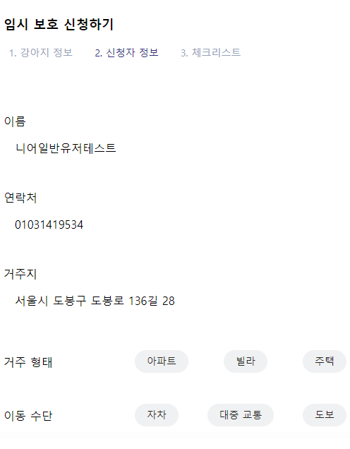

- 목표 
  저희 프로젝트의 목표입니다. 
  내가 위치한 지역의 보호소 위치를 확인할 수 있고 
  해당 보호소에 유기 동물 신청, 임시 보호 신청등을 하여  
  유기견의 보호에 작게나마 참여를 할 수 있습니다.

  </img>
  </img>
  </img>

- 기능
  - 보호소 찾기
  

    </img>
    </img>
    </img>
  

  - 유기견 등록하기
  주변에서 발견한 유기견을 등록할 수 있는 페이지입니다.
  

    </img>
    </img>
    </img>
  

  - 임시 보호 신청하기
  입양은 부담스럽거나 작게 나마 유기견들에게 도움을 주고자 하는 분들은 
  임시 보호를 통해 실천할 수 있습니다.
   

    </img>
    </img>
    </img>
  

  
